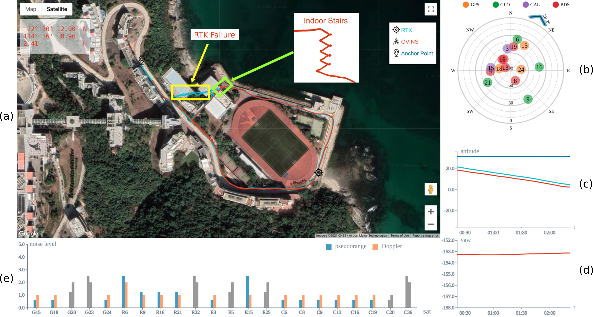

# GVINS

GVINS: Tightly Coupled GNSS-Visual-Inertial Fusion for Smooth and Consistent State Estimation. [paper link](https://arxiv.org/pdf/2103.07899.pdf)

Authors: Shaozu CAO, Xiuyuan LU and Shaojie SHEN



**GVINS** is a non-linear optimization based system that tightly fuses GNSS raw measurements with visual and inertial information for real-time and drift-free state estimation. By incorporating GNSS pseudorange and Doppler shift measurements, GVINS is capable to provide smooth and consistent 6-DoF global localization in complex environment. The system framework and VIO part are adapted from [VINS-Mono](https://github.com/HKUST-Aerial-Robotics/VINS-Mono). Our system contains the following features:

- global 6-DoF estimation in ECEF frame;
- multi-constellation support (GPS, GLONASS, Galileo, BeiDou);
- online local-ENU frame alignment;
- global pose recovery in GNSS-unfriendly or even GNSS-denied area.

**Video:**

[](https://www.youtube.com/watch?v=TebAal1ARnk "GVINS Video")

## 1. Prerequisites
### 1.1 C++11 Compiler
This package requires some features of C++11.

### 1.2 ROS
This package is developed under [ROS Kinetic](http://wiki.ros.org/kinetic) environment.

### 1.3 Eigen
Our code uses [Eigen 3.3.3](https://gitlab.com/libeigen/eigen/-/archive/3.3.3/eigen-3.3.3.zip) for matrix manipulation.

### 1.4 Ceres
We use [ceres](https://ceres-solver.googlesource.com/ceres-solver) 1.12.0 to solve the non-linear optimization problem.

### 1.5 gnss_comm
This package also requires [gnss_comm](https://github.com/HKUST-Aerial-Robotics/gnss_comm) for ROS message definitions and some utility functions. Follow [those instructions](https://github.com/HKUST-Aerial-Robotics/gnss_comm#2-build-gnss_comm-library) to build the *gnss_comm* package.

## 2. Build GVINS
Clone the repository to your catkin workspace (for example `~/catkin_ws/`):
```
cd ~/catkin_ws/src/
git clone https://github.com/HKUST-Aerial-Robotics/GVINS.git
```
Then build the package with:
```
cd ~/catkin_ws/
catkin_make
source ~/catkin_ws/devel/setup.bash
```
If you encounter any problem during the building of GVINS, we recommend you to [try docker](#docker_section) first.

## 3. <a name="docker_section"></a>Docker Support
To simplify the building process, we add docker in our code. Docker is like a sandbox so it can isolate our code from your local environment. To run with docker, first make sure [ros](http://wiki.ros.org/ROS/Installation) and [docker](https://docs.docker.com/get-docker/) are installed on your machine. Then add your account to `docker` group by `sudo usermod -aG docker $USER`. **Logout and re-login to avoid the *Permission denied* error**, then type:
```
cd ~/catkin_ws/src/GVINS/docker
make build
```
The docker image `gvins:latest` should be successfully built after a while. Then you can run GVINS with:
```
./run.sh LAUNCH_FILE
``` 
(for example `./run.sh visensor_f9p.launch`). Open another terminal and play your rosbag file, then you should be able to see the result. If you modify the code, simply re-run `./run.sh LAUNCH_FILE` to update.


## 4. Run GVINS with our dataset
Download our [GVINS-Dataset](https://github.com/HKUST-Aerial-Robotics/GVINS-Dataset) and launch GVINS via:
```
roslaunch gvins visensor_f9p.launch
```
Open another terminal and launch the rviz by:
```
rviz -d ~/catkin_ws/src/GVINS/config/gvins_rviz_config.rviz
```
Then play the bag:
```
rosbag play sports_field.bag
```

## 5. Run GVINS with your device


1. Setup the visual-inertial sensor suit according to [these instructions](https://github.com/HKUST-Aerial-Robotics/VINS-Mono#5-run-with-your-device);
2. Configure your GNSS receiver to output raw measurement and ephemeris and convert them as ros messages. If you are using u-blox receiver, please checkout our [ublox_driver](https://github.com/HKUST-Aerial-Robotics/ublox_driver) package;
3. Deal with the synchronization between visual-inertial sensor and GNSS receiver. A coarse synchronization can be done via [ublox_driver](https://github.com/HKUST-Aerial-Robotics/ublox_driver) but the accuracy is not guaranteed. For better performance, we recommend hardware synchronization via receiver's PPS signal;
4. Change the topic name in the config file and create a launch file pointing to the corresponding config file. Launch the GVINS with `roslaunch gvins YOUR_LAUNCH_FILE.launch`.


## 6. Acknowledgements
The system framework and VIO part are adapted from [VINS-Mono](https://github.com/HKUST-Aerial-Robotics/VINS-Mono). We use [camodocal](https://github.com/hengli/camodocal) for camera modelling and [ceres](http://ceres-solver.org/) to solve the optimization problem.

## 7. Licence
The source code is released under [GPLv3](https://www.gnu.org/licenses/gpl-3.0.html) license.
